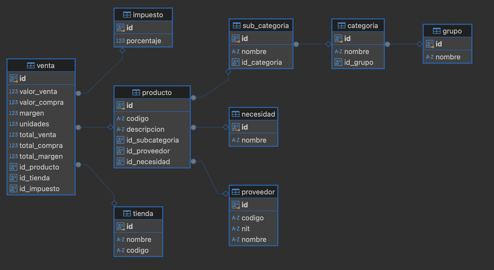
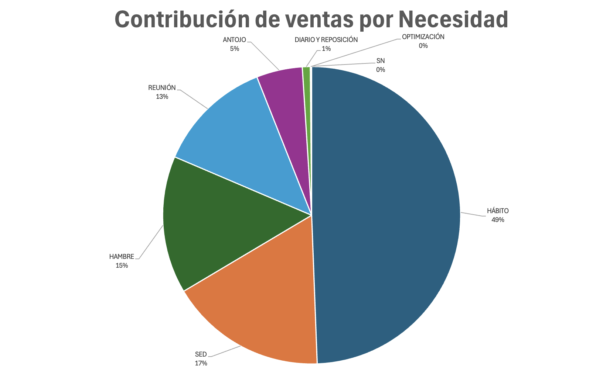
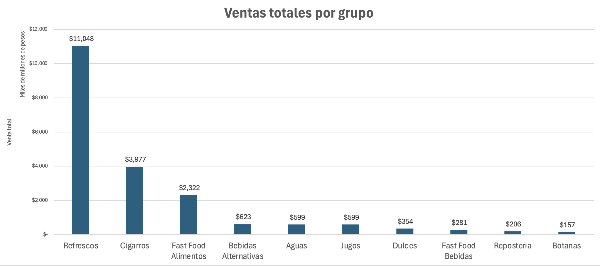

# Examen Final - Bases de Datos Empresariales

## Instrucciones Generales

Este examen está dividido en tres secciones que corresponden a los aspectos evaluados en la materia: consultas SQL, análisis gráfico en Excel y análisis de negocio. Lee atentamente cada sección y sigue las instrucciones específicas.

## Descripción de la Base de Datos

La base de datos utilizada para este examen corresponde a una estructura de datos empresariales para una cadena de tiendas, Tiendas EIA. La base de datos incluye información sobre productos, categorías, proveedores, ventas, tiendas y otros aspectos críticos para la operación de la empresa. Las tablas están relacionadas para facilitar la consulta de datos y el análisis de rendimiento de ventas, márgenes, y distribución de necesidades.

## Datos de conexión
```
host: aws-0-us-east-1.pooler.supabase.com
port: 6543
database: postgres
username: parcial.pqihitksbcrxfddfmzfg
password: ***********
schema: retail
```
### Diagrama Entidad-Relación

Para comprender mejor la estructura de la base de datos, revisa el diagrama entidad-relación en el siguiente enlace:



## Sección 1: Queries (30%)

Debes realizar cinco consultas SQL que permitan extraer información clave de la base de datos. Cada consulta deberá cumplir con los requerimientos específicos que se detallan a continuación. Este ejercicio tiene un valor total de 30%, es decir, 6% por cada query.

1. Genera una consulta que muestre la suma del margen total y la cantidad total de unidades vendidas para cada categoría de producto. Solo debes mostrar las categorías que hayan generado un margen total superior a $20.000'000.000 (20 mil millones), en orden descendente de margen total.

2. Realiza una consulta que muestre el nombre del proveedor, la necesidad de sus productos y el total de compras acumulado por proveedor y necesidad. Solo debes incluir aquellos registros que tengan un total de compras superior a $90.000'000.000 (90 mil millones).

3. Escribe una consulta que muestre el nombre de la tienda, el porcentaje de impuesto aplicado y el margen total para cada combinación de tienda e impuesto. Ordena los resultados por margen total en orden descendente.

4. Encuentra el total de ventas de cada producto en cada categoría. También, cuenta cuántos productos hay en cada categoría. Finalmente, calcula la contribución de cada producto a la subcategoría. La contribución se calcula dividiendo el total vendido entre la cantidad de productos en esa subcategoría.

5. Genera una consulta que calcule la suma total de ventas y el margen total por cada grupo de productos, y muestra solo los grupos donde el margen dividido el total de ventas sea mayor a 0.2 (que el margen sea más del 20% de las ventas).

## Sección 2: Análisis Gráfico en Excel (30%)

Esta sección está dividida en dos partes, cada una con un valor de 15%.

### Parte 1: Creación de Gráficas (15%)

Debes generar dos gráficas en Excel utilizando los datos extraídos de la base de datos:

1. Una gráfica de barras que muestre las ventas totales por cada categoría. Compara las diferentes categorías y presenta esta comparación visualmente en una gráfica de barras.

2. Una gráfica de torta que muestre el costo pagado al top 10 de proveedores.

### Parte 2: Ingeniería Inversa de Gráficas (15%)

Revisa las dos gráficas mostradas a continuación. Utilizando tu conocimiento de SQL, debes crear una consulta que permita obtener los datos necesarios para cada una de las gráficas:


1. Una gráfica de torta que muestra la distribución de ventas por necesidad, visualizando la proporción de ventas en cada necesidad.


2. Una gráfica de barras que muestra el total vendido por grupo.


## Sección 3: Análisis de Negocio (40%)

Desarrolla un análisis de negocio basado en las cinco consultas realizadas en la **Sección 1** y las cuatro gráficas de la **Sección 2**. Este análisis debe ser un texto escrito y debe incluir un análisis cruzado de los datos que proporcione insights estratégicos para la gerencia de Tiendas EIA.

Algunas preguntas que pueden guiar tu análisis son:

- ¿Cuáles son las categorías de productos más rentables y menos rentables?
- ¿Cuál es el desempeño de las tiendas en relación con los impuestos aplicados y los márgenes generados?
- ¿Qué proveedores contribuyen más al crecimiento de ventas en necesidades específicas?
- ¿Cuáles productos presentan alta rotación y deberían ser priorizados en inventario?

Incluye preguntas adicionales que te generen interés y no te limites a responder las preguntas explícitas puestas anteriormente. Este análisis debe proporcionar recomendaciones estratégicas y relevantes para la toma de decisiones por parte de la gerencia, tales como mejoras en la estrategia de productos o en las negociaciones con proveedores.

### Entrega

Enviar a daniel.saldarriaga@eia.edu.co un sólo documento que muestre:
1. Los queries con su resultado del punto 1.
2. Las gráficas del punto 2.
3. Los queries del punto 2.
4. El análisis del punto 3.
